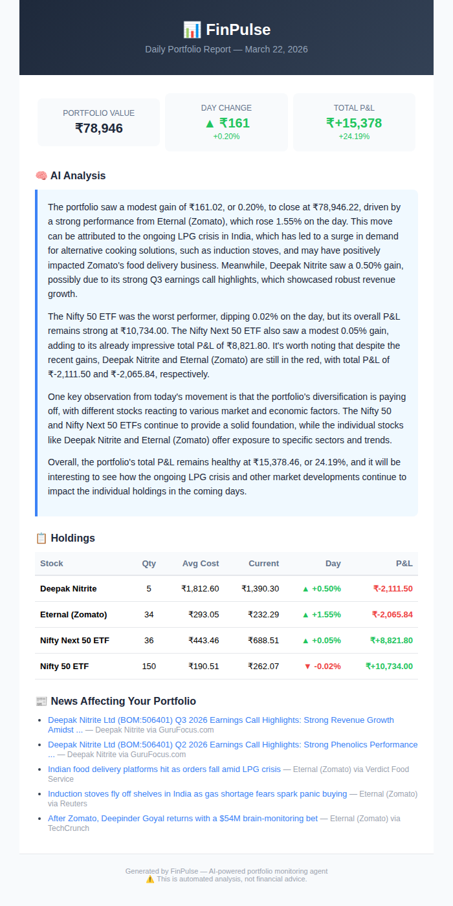

# 📊 FinPulse — AI-Powered Daily Portfolio Report Agent

An autonomous agent that monitors your stock portfolio, fetches live market data and news, generates AI-powered analysis, and delivers a beautiful HTML report to your inbox every morning — fully automated, zero cost.

## 📬 What You Get Every Morning



A daily email with:
- **Portfolio performance** — current value, day change, total P&L for each holding
- **AI-generated analysis** — explains *why* your portfolio moved, connecting stock movements to recent news
- **News digest** — recent headlines relevant to your specific holdings
- **Actionable insights** — observations about portfolio concentration, trends, and risks

All grounded in real data, not generic market commentary.

## 🏗️ Architecture

```
GitHub Actions (cron: 8:00 AM IST, weekdays)
         │
         ▼
┌─────────────────┐
│  Load Portfolio  │ ← reads holdings from portfolio.csv
└────────┬────────┘
         ▼
┌─────────────────┐
│  Fetch Prices   │ ← yfinance (free, no API key)
│  & Calculate P&L│
└────────┬────────┘
         ▼
┌─────────────────┐
│  Fetch News     │ ← yfinance news feed
│  per holding    │
└────────┬────────┘
         ▼
┌─────────────────┐
│  AI Analysis    │ ← Groq (Llama 3.3 70B, free tier)
│  & Report Gen   │
└────────┬────────┘
         ▼
┌─────────────────┐
│  Send Email     │ ← Gmail SMTP (free)
│  (HTML report)  │
└─────────────────┘
```

**Runs entirely for free:** GitHub Actions (free cron) + yfinance (free data) + Groq (free LLM) + Gmail SMTP (free email).

## 🚀 Quick Start

### 1. Clone and install

```bash
git clone https://github.com/YOUR_USERNAME/finpulse.git
cd finpulse
python -m venv venv
source venv/bin/activate  # Windows: venv\Scripts\activate
pip install -r requirements.txt
```

### 2. Configure

```bash
cp .env.example .env
```

Edit `.env` with:
- **GROQ_API_KEY** — get one free at [console.groq.com](https://console.groq.com)
- **EMAIL_SENDER** — your Gmail address
- **EMAIL_PASSWORD** — a Gmail App Password ([create one here](https://myaccount.google.com/apppasswords))
- **EMAIL_RECEIVER** — where to receive reports (can be same as sender)

### 3. Add your portfolio

Edit `portfolio.csv` with your holdings:

```csv
ticker,name,shares,buy_price,buy_date
RELIANCE.NS,Reliance Industries,10,2450.00,2024-03-15
TCS.NS,Tata Consultancy,5,3800.00,2024-06-01
```

Use `.NS` suffix for NSE stocks, `.BO` for BSE.

### 4. Test locally

```bash
python main.py
```

### 5. Automate with GitHub Actions

Push to GitHub, then add secrets in **Settings → Secrets and variables → Actions**:
- `GROQ_API_KEY`
- `EMAIL_SENDER`
- `EMAIL_PASSWORD`
- `EMAIL_RECEIVER`

The workflow runs automatically at 8:00 AM IST on weekdays. You can also trigger it manually from the **Actions** tab.

## 🛠️ Tech Stack

| Component | Technology | Why |
|-----------|-----------|-----|
| Market Data | **yfinance** | Free, no API key, covers global markets |
| AI Analysis | **Groq (Llama 3.3 70B)** | Free tier, fast inference |
| Email | **Gmail SMTP** | Free, reliable, HTML support |
| Automation | **GitHub Actions** | Free cron scheduling, no server needed |
| Language | **Python + Pandas** | Data processing and calculations |

## 📁 Project Structure

```
finpulse/
├── main.py                      # Orchestrator — runs the full pipeline
├── portfolio.py                 # Loads CSV, fetches prices, calculates P&L
├── report.py                    # AI analysis + HTML report generation
├── email_sender.py              # Gmail SMTP delivery
├── portfolio.csv                # Your holdings (edit this)
├── requirements.txt             # Python dependencies
├── .env.example                 # Environment variable template
├── .github/workflows/
│   └── daily_report.yml         # GitHub Actions cron job
└── README.md
```

## 💡 Key Design Decisions

**CSV over API for portfolio data:** Broker APIs (like Zerodha's Kite Connect) cost money and require daily re-authentication. A simple CSV is free, works offline, and only needs updating when you make a trade. The agent's value is in the analysis, not the data import.

**Groq over OpenAI:** Free tier with Llama 3.3 70B — a highly capable model at zero cost. The analysis quality is comparable to GPT-4 for this use case.

**GitHub Actions over a server:** No infrastructure to manage, no costs, no uptime concerns. Push to GitHub and it runs forever.

**HTML email over a dashboard:** A daily email is passive — you don't need to check anything. The information comes to you, which is the whole point of an autonomous agent.

## 🔮 Potential Extensions

- [ ] Portfolio allocation visualization (pie chart in email)
- [ ] Weekly/monthly performance summary emails
- [ ] Alerts for significant price movements (>5% in a day)
- [ ] Support for multiple portfolios (stocks, crypto, mutual funds)
- [ ] Integration with Google Sheets for easier portfolio updates
- [ ] Comparison with benchmark indices (Nifty 50, Sensex)

## 📜 License

MIT
